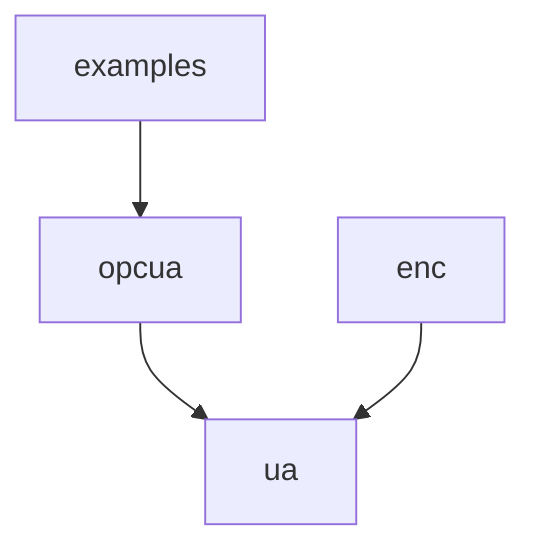

# opcua-go

  [](https://github.com/protocol-laboratory/opcua-go/releases) [](https://pkg.go.dev/github.com/protocol-laboratory/opcua-go) [](https://codecov.io/gh/protocol-laboratory/opcua-go)

Here’s a simplified explanation of the directory structure and a mermaid diagram to represent the package dependencies:

## Project Structure

```
examples/
|-- client/
|-- server/
opcua/
|-- ua/
|-- |-- enc/
```

These packages' dependency relationship is represented in the following diagram:


